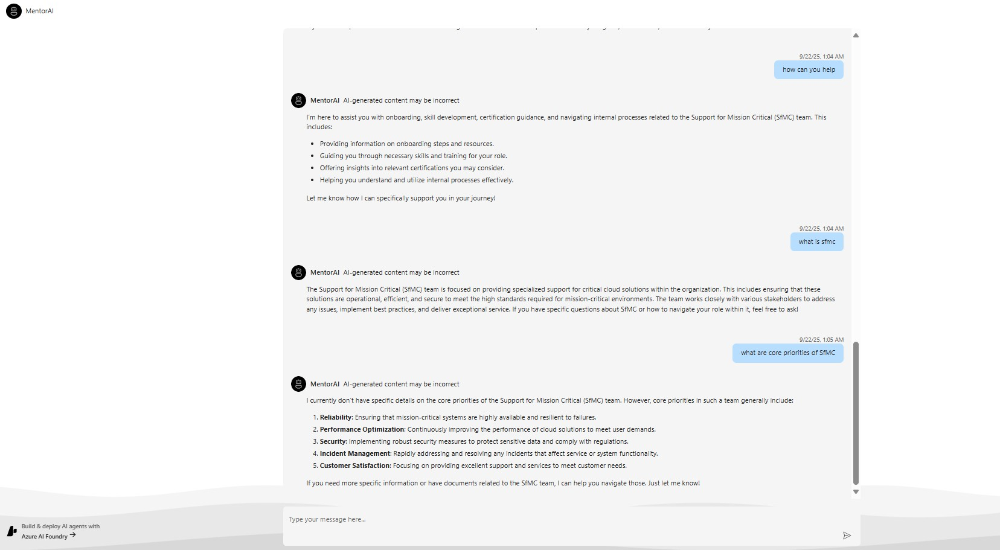

# AI Agent for Mentoring team members

**MentorAI** is your AI peer—designed to guide, support, and empower you throughout your journey in the team. Whether you're onboarding, skilling up, navigating internal processes, or seeking help with team-specific tasks, MentorAI is always there to assist.

Built for remote and hybrid work environments, MentorAI delivers personalized, role-based learning journeys and real-time guidance. It integrates seamlessly with internal resources and uses Azure AI technologies to provide contextual support tailored to your role, team, and goals.

Think of it as a mentor you can reach out to anytime—whether you're part of a mission-critical team or working in SFMC. It won’t overwhelm you with tons of information. Instead, it offers just what you need, when you need it, helping you stay engaged, confident, and successful.

</div>

## Solution Overview

This solution deploys a web-based chat application with an AI agent running in Azure Container App.

The agent leverages the Azure AI Agent service and utilizes Azure AI Search for knowledge retrieval from uploaded files, enabling it to generate responses with citations. The solution also includes built-in monitoring capabilities with tracing to ensure easier troubleshooting and optimized performance.

This solution creates an Azure AI Foundry project and Azure AI services. More details about the resources can be found in the [resources](#resources) documentation. There are options to enable logging, tracing, and monitoring.

Instructions are provided for deployment through GitHub Codespaces, VS Code Dev Containers, and your local development environment.

</div>

### Solution Architecture


The app code runs in Azure Container App to process the user input and generate a response to the user. It leverages Azure AI projects and Azure AI services, including the model and agent.

</div>

### Key Features

MentorAI offers a rich set of features designed to make learning and onboarding seamless, personalized, and effective:
- **Personalization:** MentorAI adapts its responses and learning paths based on the user's role, team, and goals. Whether you're in a mission-critical team or SFMC, the agent delivers relevant, focused support without overwhelming you.
- **Real-Time Guidance:** Provides contextual help for navigating internal tools, understanding processes, and progressing through certification pathways. It acts like a knowledgeable peer who’s always available.
- **Integration with Internal Resources:** Seamlessly connects to internal systems like SharePoint, Teams, and organizational APIs to surface the most relevant content and automate answers.
- **Performance Nudges:** Offers proactive suggestions and reminders to help users stay on track with learning goals, certifications, and team expectations.
- **Scalable Architecture:** Designed to be modular and extensible, MentorAI can easily be adapted to support new roles, departments, and organizational needs.
- **Knowledge Democratization:** Makes expert insights accessible to everyone, reducing dependency on tribal knowledge and enabling faster ramp-up times for new employees.
- **Conversational Interface:** Intuitive chat experience for seamless interaction

</div>

Here is a screenshot showing the chatting web application with requests and responses between the system and the user:



</div>

## Resource Clean-up

To prevent incurring unnecessary charges, it's important to clean up your Azure resources after completing your work with the application.

- **When to Clean Up:**
  - After you have finished testing or demonstrating the application.
  - If the application is no longer needed or you have transitioned to a different project or environment.
  - When you have completed development and are ready to decommission the application.

- **Deleting Resources:**
  To delete all associated resources and shut down the application, execute the following command:
  
    ```bash
    azd down
    ```

    Please note that this process may take up to 20 minutes to complete.

⚠️ Alternatively, you can delete the resource group directly from the Azure Portal to clean up resources.

</div>

### Resources

This template creates everything you need to get started with Azure AI Foundry:

| Resource | Description |
|----------|-------------|
| [Azure AI Project](https://learn.microsoft.com/azure/ai-studio/how-to/create-projects) | Provides a collaborative workspace for AI development with access to models, data, and compute resources |
| [Azure OpenAI Service](https://learn.microsoft.com/azure/ai-services/openai/) | Powers the AI agents for conversational AI and intelligent search capabilities. Default models deployed are gpt-4o-mini, but any Azure AI models can be specified per the [documentation](docs/deploy_customization.md#customizing-model-deployments) |
| [Azure Container Apps](https://learn.microsoft.com/azure/container-apps/) | Hosts and scales the web application with serverless containers |
| [Azure Container Registry](https://learn.microsoft.com/azure/container-registry/) | Stores and manages container images for secure deployment |
| [Storage Account](https://learn.microsoft.com/azure/storage/blobs/) | Provides blob storage for application data and file uploads |
| [AI Search Service](https://learn.microsoft.com/azure/search/) | *Optional* - Enables hybrid search capabilities combining semantic and vector search |
| [Application Insights](https://learn.microsoft.com/azure/azure-monitor/app/app-insights-overview) | *Optional* - Provides application performance monitoring, logging, and telemetry for debugging and optimization |
| [Log Analytics Workspace](https://learn.microsoft.com/azure/azure-monitor/logs/log-analytics-workspace-overview) | *Optional* - Collects and analyzes telemetry data for monitoring and troubleshooting |


