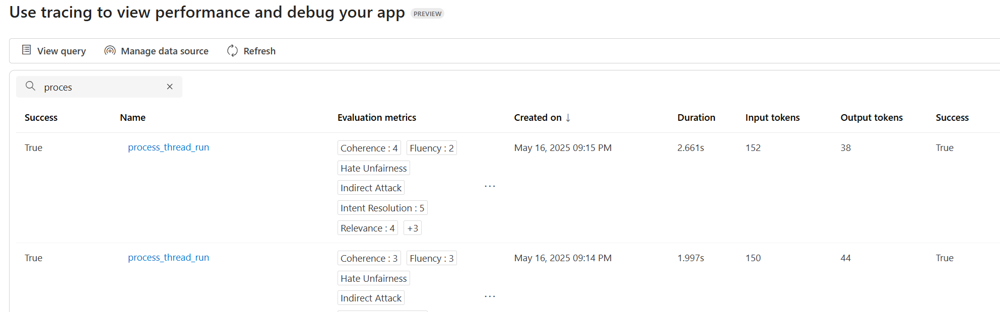

# Other Features

## Tracing and Monitoring

**First, if tracing isn't enabled yet, enable tracing by setting the environment variable:**

```shell
azd env set ENABLE_AZURE_MONITOR_TRACING true
azd deploy
```

You can view console logs in the Azure portal. You can get the link to the resource group with the azd tool:

```shell
azd show
```

Or if you want to navigate from the Azure portal main page, select your resource group from the 'Recent' list, or by clicking the 'Resource groups' and searching your resource group there.

After accessing your resource group in Azure portal, choose your container app from the list of resources. Then open 'Monitoring' and 'Log Stream'. Choose the 'Application' radio button to view application logs. You can choose between real-time and historical using the corresponding radio buttons. Note that it may take some time for the historical view to be updated with the latest logs.

You can view the App Insights tracing in Azure AI Foundry. Select your project on the Azure AI Foundry page and then click 'Tracing'. 


## Agent Evaluation

**First, make sure tracing is working by following the steps in the [Tracing and Monitoring](#tracing-and-monitoring) section above.**

AI Foundry offers a number of [built-in evaluators](https://learn.microsoft.com/azure/ai-foundry/how-to/develop/agent-evaluate-sdk) to measure the quality, efficiency, risk and safety of your agents. For example, intent resolution, tool call accuracy, and task adherence evaluators are targeted to assess the performance of agent workflow, while content safety evaluator checks for inappropriate content in the responses such as violence or hate. (screenshot)

In this template, we show how these evaluations can be performed during different phases of your development cycle.

- **Local development**: You can use this [local evaluation script](../evals/evaluate.py) to get performance and evaluation metrics based on a set of [test queries](../evals/eval-queries.json) for a sample set of built-in evaluators.

  The script reads the following environment variables:
  - `AZURE_EXISTING_AIPROJECT_ENDPOINT`: AI Project endpoint
  - `AZURE_EXISTING_AGENT_ID`: AI Agent Id, with fallback logic to look up agent Id by name `AZURE_AI_AGENT_NAME`
  - `AZURE_AI_AGENT_DEPLOYMENT_NAME`: Deployment model used by the AI-assisted evaluators, with fallback logic to your agent model

** (Optional) All of these are generated locally in [`.env`](../src/.env) after executing `azd up` except `AZURE_EXISTING_AGENT_ID` which is generated remotely.  To find this variables remotely in Container App, follow this:

1. Go to [Azure AI Foundry Portal](https://ai.azure.com/) and sign in
2. Click on your project from the homepage
3. In the left-hand menu, select Agents
4. Choose the agent you want to inspect
5. The Agent ID will be shown in the agent’s detail panel—usually near the top or under the “Properties” or “Overview” tab [Entra Agent ID Spec]


  
To install required packages and run the script:  

  ```shell
  python -m pip install -r src/requirements.txt
  python -m pip install azure-ai-evaluation

  python evals/evaluate.py
  ```

- **Monitoring**: When tracing is enabled, the [application code](../src/api/routes.py) sends an asynchronous evaluation request after processing a thread run, allowing continuous monitoring of your agent. You can view results from the AI Foundry Tracing tab.
    
    Alternatively, you can go to your Application Insights logs for an interactive experience. To access Application Insights logs in the Azure portal:
    
    1. Navigate to your resource group (use `azd show` to get the link)
    2. Find and click on the Application Insights resource (usually named starts with `appi-`)
    3. In the left menu, click on **Logs** under the **Monitoring** section
    4. You can now run KQL queries in the query editor
    
    Here is an example query to see logs on thread runs and related events:

    ```kql
    let thread_run_events = traces
    | extend thread_run_id = tostring(customDimensions.["gen_ai.thread.run.id"]);
    dependencies 
    | extend thread_run_id = tostring(customDimensions.["gen_ai.thread.run.id"])
    | join kind=leftouter thread_run_events on thread_run_id
    | where isnotempty(thread_run_id)
    | project timestamp, thread_run_id, name, success, duration, event_message = message, event_dimensions=customDimensions1
   ```


- **Continuous Integration**: You can try the [AI Agent Evaluation GitHub action](https://github.com/microsoft/ai-agent-evals) using the [sample GitHub workflow](../.github/workflows/ai-evaluation.yaml) in your CI/CD pipeline. This GitHub action runs a set of queries against your agent, performs evaluations with evaluators of your choice, and produce a summary report. It also supports a comparison mode with statistical test, allowing you to iterate agent changes on your production environment with confidence. See [documentation](https://github.com/microsoft/ai-agent-evals) for more details.

## AI Red Teaming Agent

The [AI Red Teaming Agent](https://learn.microsoft.com/azure/ai-foundry/concepts/ai-red-teaming-agent) is a powerful tool designed to help organizations proactively find security and safety risks associated with generative AI systems during design and development of generative AI models and applications.

In this [script](../airedteaming/ai_redteaming.py), you will be able to set up an AI Red Teaming Agent to run an automated scan of your agent in this sample. No test dataset or adversarial LLM is needed as the AI Red Teaming Agent will generate all the attack prompts for you.

To install required extra packages from Azure AI Evaluation SDK and run the script in your local development environment:  

```shell
python -m pip install -r src/requirements.txt
python -m pip install azure-ai-evaluation[redteam]

python airedteaming/ai_redteaming.py
```

Read more on supported attack techniques and risk categories in our [documentation](https://learn.microsoft.com/azure/ai-foundry/how-to/develop/run-scans-ai-red-teaming-agent).
